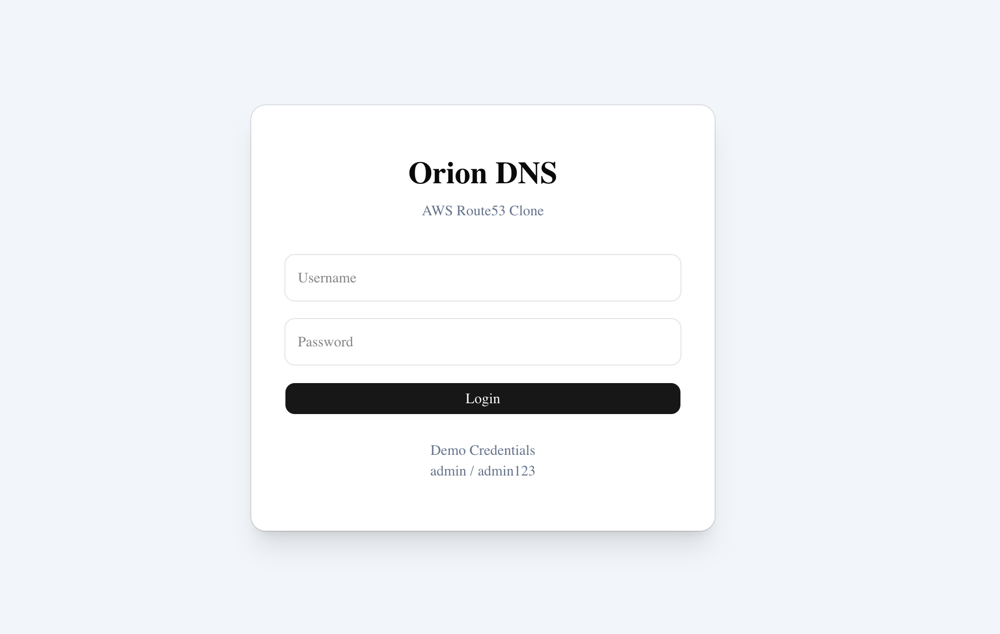
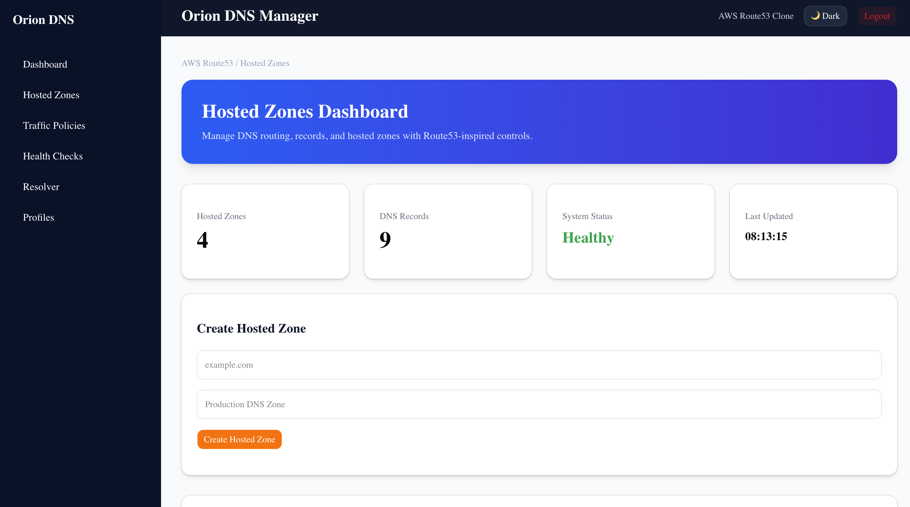
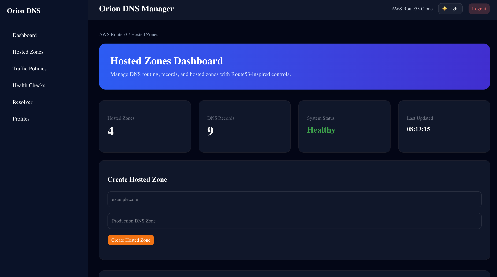
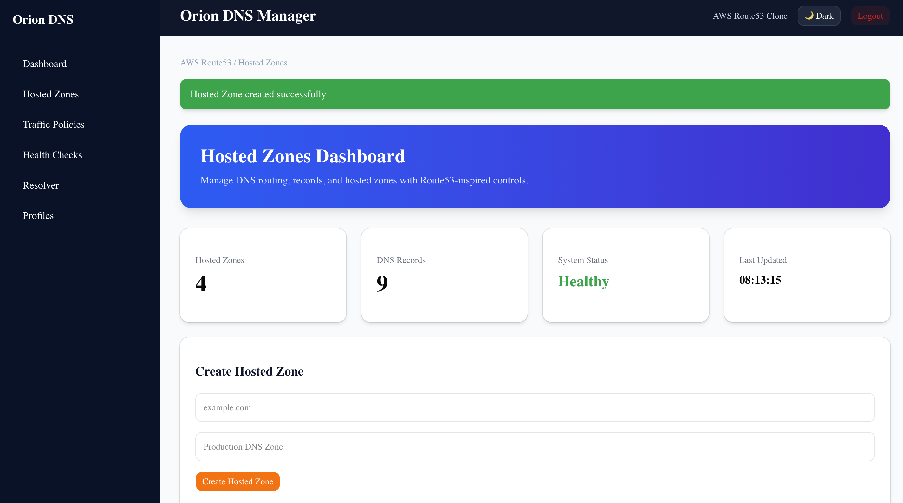
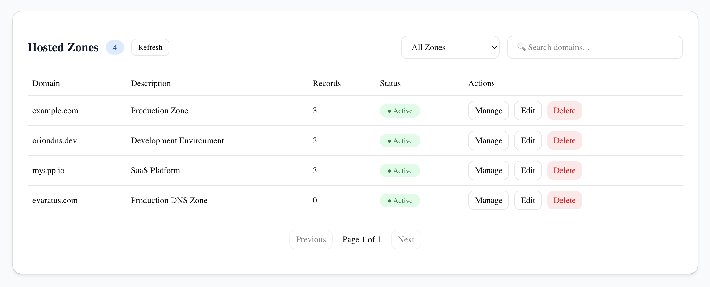
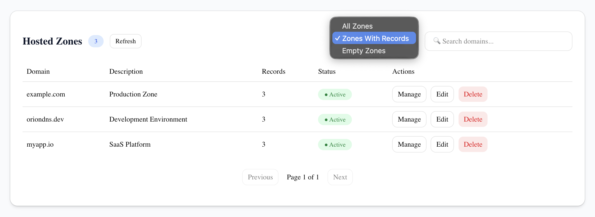
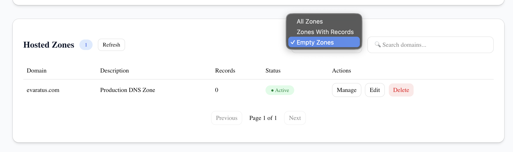
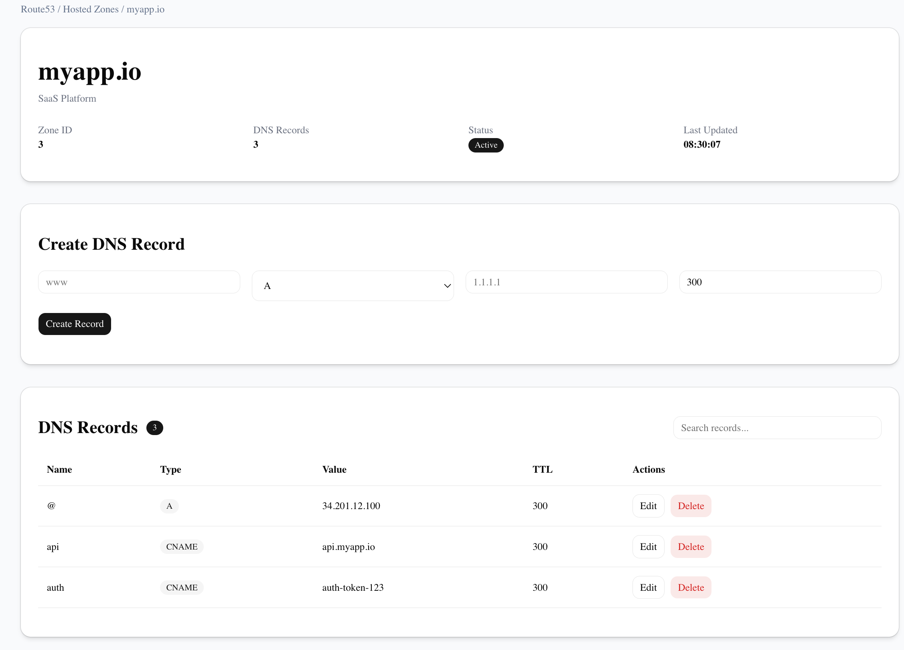
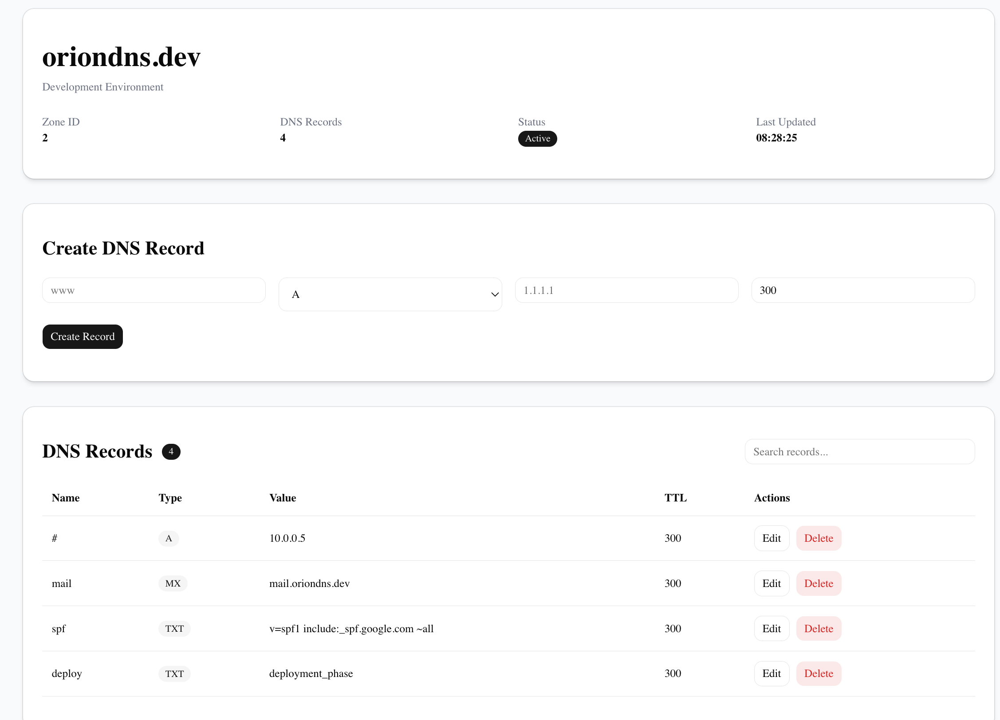

# Orion DNS

A production-ready DNS Management Platform inspired by AWS Route 53, built using FastAPI, Next.js, SQLite, TypeScript, Tailwind CSS, and ShadCN UI.

Orion DNS enables users to create and manage hosted zones, configure DNS records, monitor endpoint health, and visualize DNS infrastructure through a modern cloud-native interface.

---
> **Note**
>
> This project uses SQLite as required by the assignment. The application is deployed on free-tier cloud infrastructure for demonstration purposes. In some cases, backend redeployments may reset application data, resulting in an empty dashboard on first visit. All functionality remains fully operational, and reviewers can create Hosted Zones, DNS Records, and Health Checks directly through the interface.

## Live Demo

### Frontend

https://orion-lyart-phi.vercel.app/

### Backend API

https://orion-api-e0cc.onrender.com

### Swagger Documentation

https://orion-api-e0cc.onrender.com/docs

---

## Features

### Hosted Zone Management

- Create Hosted Zones
- Update Hosted Zones
- Delete Hosted Zones
- Search Hosted Zones
- Zone Details View
- Record Count Tracking

### DNS Record Management

- Create DNS Records
- Update DNS Records
- Delete DNS Records
- Search DNS Records
- TTL Configuration

Supported Record Types:

- A
- AAAA
- CNAME
- TXT
- MX
- NS
- PTR
- SRV
- CAA

### Dashboard

- Infrastructure Overview
- Total Hosted Zones
- Total DNS Records
- Real-Time Statistics
- System Status Monitoring

### Health Checks

- Endpoint Availability Monitoring
- Health Status Tracking
- Health Check Management

### Authentication

- Secure Login
- Protected Routes
- Session Management

### User Experience

- Responsive Design
- Light/Dark Mode
- AWS Route53-Inspired Interface
- Search & Filtering
- Notifications & Alerts
- Sidebar Navigation

---

## Screenshots

### 1. Login Page



---

### 2. Dashboard (Light Mode)



---

### 3. Dashboard (Dark Mode)



---

### 4. Success Notification



---

### 5. Hosted Zones List



---

### 6. Hosted Zones with DNS Records



---

### 7. Empty Zone Filter



---

### 8. DNS Records – MyApp



---

### 9. DNS Records – OrionDNS



---

## System Architecture

```text
                        ┌─────────────────┐
                        │      User       │
                        └────────┬────────┘
                                 │
                                 ▼
                  ┌──────────────────────────┐
                  │     Next.js Frontend     │
                  │        (Vercel)          │
                  └──────────┬───────────────┘
                             │
                             ▼
                  ┌──────────────────────────┐
                  │      FastAPI Backend     │
                  │        (Render)          │
                  └──────────┬───────────────┘
                             │
                             ▼
                  ┌──────────────────────────┐
                  │      SQLAlchemy ORM      │
                  └──────────┬───────────────┘
                             │
                             ▼
                  ┌──────────────────────────┐
                  │      SQLite Database     │
                  └──────────────────────────┘
```

## Database Schema

Orion DNS uses **SQLite** with **SQLAlchemy ORM** to persist application data. The database is designed around Hosted Zones, DNS Records, Authentication, and Health Checks.

### Entity Relationship Diagram

```text
┌──────────────┐
│    Users     │
└──────────────┘
id (PK)
username
password
created_at


┌──────────────────┐
│   Hosted Zones   │
└──────────────────┘
id (PK)
name
description
created_at

         │
         │ One-to-Many
         ▼

┌──────────────────┐
│   DNS Records    │
└──────────────────┘
id (PK)
zone_id (FK)
name
type
value
ttl
created_at


┌──────────────────┐
│  Health Checks   │
└──────────────────┘
id (PK)
name
endpoint
status
last_checked
created_at
```

### Relationships

#### Hosted Zone → DNS Records

A Hosted Zone can contain multiple DNS Records.

```text
Hosted Zone (1)
      │
      ▼
DNS Records (Many)
```

Example:

```text
oriondns.dev
├── A      → 1.1.1.1
├── CNAME  → www.oriondns.dev
├── MX     → mail.oriondns.dev
└── TXT    → verification-token
```

### Database Tables

| Table | Description |
|---------|------------|
| Users | Stores authentication and user session information |
| Hosted Zones | Stores DNS hosted zones managed by users |
| DNS Records | Stores DNS entries associated with hosted zones |
| Health Checks | Stores endpoint monitoring configurations and status |

### ORM Architecture

```text
FastAPI
    │
    ▼
SQLAlchemy ORM
    │
    ▼
SQLite Database
```

### Benefits

- Persistent storage using SQLite
- SQLAlchemy relationship management
- Clean separation between models, schemas, and API routes
- Easy migration path to PostgreSQL or MySQL
- Scalable database design inspired by cloud DNS platforms

---

## Tech Stack

### Frontend

- Next.js 15
- TypeScript
- Tailwind CSS
- ShadCN UI
- Axios

### Backend

- FastAPI
- SQLAlchemy
- SQLite
- Pydantic

### Deployment

- Vercel
- Render

### Development Tools

- Git
- GitHub
- VS Code

---

## API Endpoints

### Hosted Zones

| Method | Endpoint |
|----------|----------|
| GET | `/hosted-zones/` |
| GET | `/hosted-zones/{id}` |
| POST | `/hosted-zones/` |
| PUT | `/hosted-zones/{id}` |
| DELETE | `/hosted-zones/{id}` |

### DNS Records

| Method | Endpoint |
|----------|----------|
| GET | `/records/zone/{zone_id}` |
| POST | `/records/{zone_id}` |
| PUT | `/records/{record_id}` |
| DELETE | `/records/{record_id}` |

### Dashboard

| Method | Endpoint |
|----------|----------|
| GET | `/dashboard/stats` |

### Health Checks

| Method | Endpoint |
|----------|----------|
| GET | `/health-checks/` |
| POST | `/health-checks/` |
| DELETE | `/health-checks/{id}` |

---

## Project Structure

```text
orion/
│
├── backend/
│   │
│   ├── app/
│   │   ├── models/
│   │   ├── routers/
│   │   ├── schemas/
│   │   ├── services/
│   │   └── database.py
│   │
│   ├── screenshots/
│   │   ├── login-page.png
│   │   ├── dashboard-light.png
│   │   ├── dashboard-dark.png
│   │   ├── hosted-zones-all.png
│   │   ├── hosted-zones-with-records.png
│   │   ├── hosted-zones-empty.png
│   │   ├── hosted-zone-created.png
│   │   └── dns-records.png
│   │
│   ├── requirements.txt
│   └── run.py
│
├── frontend/
│   │
│   ├── app/
│   ├── components/
│   ├── lib/
│   ├── public/
│   └── package.json
│
└── README.md
```

---

## Running Locally

### Clone Repository

```bash
git clone https://github.com/KoppisettiGnanaVishnu/Orion.git

cd Orion
```

### Backend Setup

```bash
cd backend

python -m venv venv

source venv/bin/activate

pip install -r requirements.txt

python run.py
```

Backend runs at:

```text
http://localhost:8000
```

Swagger Docs:

```text
http://localhost:8000/docs
```

---

### Frontend Setup

```bash
cd frontend

npm install

npm run dev
```

Frontend runs at:

```text
http://localhost:3000
```

---

## Deployment

### Frontend

Hosted on Vercel

```text
https://orion-lyart-phi.vercel.app/
```

### Backend

Hosted on Render

```text
https://orion-api-e0cc.onrender.com
```

### API Documentation

```text
https://orion-api-e0cc.onrender.com/docs
```

---

## Current Status

### Version

```text
v1.0.0
```

### Completed Features

- Hosted Zone CRUD Operations
- DNS Record CRUD Operations
- Authentication System
- Dashboard Analytics
- Search & Filtering
- Health Checks
- Frontend Deployment
- Backend Deployment
- API Documentation
- Light/Dark Theme Support
- Route53-Inspired UI

### Future Enhancements

- Traffic Policies
- Resolver Rules
- Advanced Routing Strategies
- RBAC (Role-Based Access Control)
- Audit Logs
- Analytics Dashboard
- Monitoring & Metrics

---

## Learning Outcomes

This project helped explore:

- FastAPI Backend Development
- REST API Design
- SQLAlchemy ORM
- SQLite Database Management
- Next.js Full-Stack Development
- TypeScript
- ShadCN UI
- Frontend-Backend Integration
- Cloud Deployment Workflows
- DNS Infrastructure Concepts
- System Design Principles

---

## Author

### Koppisetti Gnana Vishnu

B.Tech Computer Science Engineering

GitHub:

https://github.com/KoppisettiGnanaVishnu

LinkedIn:

https://www.linkedin.com/in/koppisetti-gnana-vishnu

---

## Acknowledgements

Inspired by AWS Route 53 and modern cloud infrastructure management platforms.

Built as a full-stack engineering project to understand DNS systems, scalable API design, cloud deployment, and production-grade application architecture.
